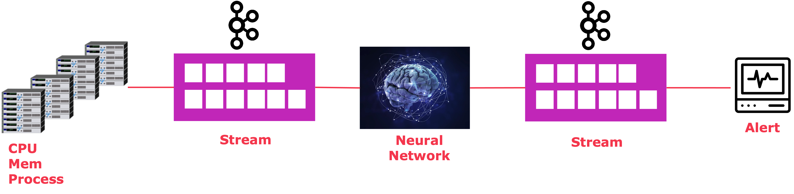

# Anomaly Detection

Sistema de detección de anomalías mediante Isloation Forest, Python, Pandas, Tensorflow y Kafka.

## Levantar Kafka  

``` bash
bin/zookeeper-server-start.sh config/zookeeper.properties
bin/kafka-server-start.sh config/server.properties
```

## Generar Topicos

``` bash
bin/kafka-topics.sh --zookeeper localhost:2181 --topic transactions --create --partitions 3 --replication-factor 1
bin/kafka-topics.sh --zookeeper localhost:2181 --topic anomalies --create --partitions 3 --replication-factor 1
```

## Habilitar ambiente Python

``` bash
python3 -m venv .
source bin/activate
pip install -r requirements.txt
```

## Orden de ejecución

``` bash
python consumer_anomaly.py
python consumer-predict.py
python producer.py
```

## Entrenar un nuevo modelo

El entrenamiento del modelo versionado se realizó con el archivo: part-088.csv del dataset de Kaggle (link mas abajo)

``` bash
python train.py
```

## Preparar archivo con set de pruebas

Como se menciona el entrenamiento se realizó con el archivo: part-088.csv del dataset de Kaggle (link mas abajo), por lo que al utilizar otros archivos del mismo dataset se deben de adecuar las columnas con el script:

``` bash
python make_file_test.py
```
Reemplazando el nombre del archivo en la variable: file_name = 'part-000'  

## Arquitectura



## Source Files

[Kaggle](https://www.kaggle.com/anomalydetectionml/features)  
